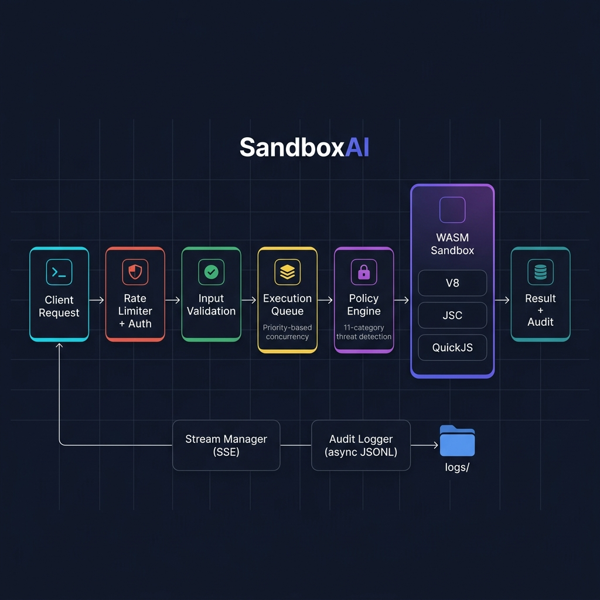

<div align="center">


# SandboxAI

**Secure AI Code Execution Platform — powered by Edge.js WASM Sandboxing**

[](LICENSE)
[](https://edge.codes)
[](https://nodejs.org)
[](https://github.com/amafjarkasi/sandbox-ai-wasm/pulls)

Execute untrusted JavaScript safely in isolated WASM sandboxes with multi-engine support, real-time streaming, security policy enforcement, and a built-in AI agent interface.

[Getting Started](#getting-started) •
[API Reference](#api-reference) •
[Security](#security-model) •
[Examples](#examples) •
[Configuration](#configuration)

</div>

---

## The Problem

AI agents, online code judges, webhook handlers, and automation platforms all share the same need: **run code you don't trust**. Native `eval()` and `child_process.exec()` are attack vectors. Docker containers add latency and operational complexity. You need something in between — fast, secure, and embeddable.

## The Solution

SandboxAI wraps code execution in **Edge.js WASM containers**, giving you process-level isolation without the overhead of containers or VMs:

- **🔒 Hard Isolation** — code runs in a WASM sandbox, not on your host OS. No filesystem, network, or process access unless explicitly granted by policy.
- **🛡️ Threat Detection** — 11 categories of dangerous patterns are analyzed and scored *before* execution. Known attack vectors (prototype pollution, command injection, eval tricks) are caught at the gate.
- **⚡ Multi-Engine** — choose between V8 (fastest), JavaScriptCore (WebKit), or QuickJS (lightweight). Engine availability is validated before execution.
- **📊 Full Audit Trail** — every execution produces a chain-of-custody log with timing, policy decisions, risk scores, and output. Persisted as async JSONL for zero event-loop impact.
- **🤖 MCP-Compatible** — drop-in tool interface for AI agents following the [Model Context Protocol](https://modelcontextprotocol.io) standard.

---

## Architecture

<div align="center">

</div>

### How a request flows

1. **Ingress** — HTTP request hits the rate limiter (configurable window + max), then API key auth (optional), then CORS validation.
2. **Validation** — Request body is parsed and validated: `code` must be a non-empty string, `engine` must be `v8`/`jsc`/`quickjs`, `timeout` must be a positive number, `policy` must be a recognized tier.
3. **Queue** — The execution is enqueued with priority-based concurrency control. A `settled` flag prevents the timeout handler and task completion from racing to double-resolve the promise.
4. **Policy Engine** — The code is scanned against 11 regex-based threat categories. Each match produces a finding with severity (`critical`/`high`/`medium`/`low`) and a cumulative risk score. If the score exceeds the policy threshold, execution is blocked.
5. **Executor** — The code is escaped (template injection safe), wrapped in an Edge.js WASM harness, and executed with the selected engine. Results are SHA256-cached for deduplication and stored with LRU eviction (max 1,000 entries).
6. **Audit** — Execution metadata is persisted asynchronously as JSONL (daily rotation) and per-execution JSON files. The in-memory audit map is capped at 10,000 entries with FIFO eviction.
7. **Response** — Result is returned as JSON, or streamed via SSE for real-time output.

---

## Getting Started

### Prerequisites

- [Edge.js](https://edge.codes) runtime (provides WASM sandboxing)
- Node.js ≥ 18 (for standard library APIs)

### Installation

```bash
git clone https://github.com/amafjarkasi/sandbox-ai-wasm.git
cd sandbox-ai-wasm
```

No `npm install` needed — the project has zero dependencies. Everything is built on Node.js standard library and Edge.js runtime APIs.

### Running

```bash
# Sandboxed mode (recommended for production)
edge --safe server.js

# Normal mode (development, no WASM isolation)
edge server.js

# Development mode with auto-reload
edge --run dev server.js
```

The server starts on `http://localhost:3000`:

| Endpoint | Description |
|----------|-------------|
| `http://localhost:3000/dashboard` | Monitoring dashboard |
| `http://localhost:3000/security` | Security findings dashboard |
| `http://localhost:3000/api/stats` | Server statistics |

### Your first execution

```bash
curl -X POST http://localhost:3000/api/execute \
  -H "Content-Type: application/json" \
  -d '{
    "code": "const fib = n => n <= 1 ? n : fib(n-1) + fib(n-2); console.log(fib(10));",
    "engine": "v8",
    "policy": "strict"
  }'
```

**Response:**

```json
{
  "id": "exec_a1b2c3d4e5f6",
  "status": "completed",
  "output": "55\n",
  "engine": "v8",
  "durationMs": 12,
  "dangerAnalysis": {
    "score": 0,
    "level": "safe",
    "findings": []
  }
}
```

---

## API Reference

### Execute Code

#### `POST /api/execute`

Run JavaScript in a sandboxed environment.

**Request body:**

| Field | Type | Default | Required | Description |
|-------|------|---------|----------|-------------|
| `code` | `string` | — | ✅ | JavaScript source code to execute |
| `engine` | `string` | `"v8"` | — | Execution engine: `v8`, `jsc`, `quickjs` |
| `policy` | `string` | `"standard"` | — | Security policy tier (see [Security Policies](#security-policies)) |
| `timeout` | `number` | per-policy | — | Max execution time in milliseconds |
| `memory` | `string` | per-policy | — | Memory limit (e.g. `"64mb"`, `"128mb"`) |
| `context` | `object` | `{}` | — | Variables injected into the execution scope |
| `language` | `string` | `"javascript"` | — | Language identifier for audit logging |

**Response fields:**

| Field | Type | Description |
|-------|------|-------------|
| `id` | `string` | Unique execution ID (`exec_` prefix) |
| `status` | `string` | `completed`, `error`, `blocked`, `timeout` |
| `output` | `string` | Captured `console.log` output |
| `engine` | `string` | Engine that ran the code |
| `durationMs` | `number` | Wall-clock execution time |
| `dangerAnalysis` | `object` | Threat scan results (score, level, findings) |
| `error` | `string` | Error message (if `status !== "completed"`) |
| `violations` | `string[]` | Policy violations (if `status === "blocked"`) |

**Error responses:**

| Status | Reason |
|--------|--------|
| `400` | Missing `code`, invalid `engine`, invalid `timeout`, or invalid `policy` |
| `401` | Missing or invalid `API_KEY` |
| `413` | Request body exceeds `MAX_BODY_SIZE` |
| `429` | Rate limit exceeded |

#### `POST /api/execute/stream`

Same parameters as `/api/execute`. Returns a `text/event-stream` (SSE) response:

```
event: chunk
data: {"chunk": "Processing...\n", "index": 0}

event: complete
data: {"id": "exec_abc123", "status": "completed", "durationMs": 45}
```

### Results & Stats

| Method | Endpoint | Description |
|--------|----------|-------------|
| `GET` | `/api/result/:id` | Retrieve cached execution result by ID |
| `GET` | `/api/stats` | Execution counts, engine usage, avg duration |
| `GET` | `/api/engines` | Engine availability and usage statistics |
| `GET` | `/api/audit/security-summary` | Findings by severity/category, recent threats |

### Dashboards

| Method | Endpoint | Description |
|--------|----------|-------------|
| `GET` | `/dashboard` | Real-time monitoring: executions, performance, engine usage |
| `GET` | `/security` | Security findings with auto-refresh (5s polling) |

---

## Security Model

### Security Policies

Four built-in policy tiers control what sandboxed code is allowed to do:

| Policy | Timeout | Memory | Network | Filesystem | Eval | Modules | Best For |
|--------|---------|--------|---------|------------|------|---------|----------|
| **`strict`** | 5s | 32 MB | ❌ None | ❌ None | ❌ | `buffer`, `crypto`, `url`, `util` | Untrusted user input |
| **`standard`** | 15s | 64 MB | 🔒 Restricted | 📖 Read-only | ❌ | + `path`, `querystring`, `string_decoder` | General workloads |
| **`extended`** | 30s | 128 MB | ✅ Allowed | 📝 Read/Write | ✅ | + `fs`, `http`, `https`, `stream`, `zlib` | Trusted internal code |
| **`agent`** | 60s | 256 MB | ✅ Allowed | 📝 Read/Write | ✅ | Full access | AI agent tool calls |

### Threat Detection

Before any code reaches the sandbox, the **Policy Engine** scans it against 11 categories of known dangerous patterns:

| # | Category | Patterns Detected | Severity |
|---|----------|-------------------|----------|
| 1 | **Command Execution** | `exec`, `spawn`, `execSync`, `execFile` | 🔴 Critical |
| 2 | **Code Injection** | `eval()`, `new Function()`, `vm.runInContext` | 🔴 Critical |
| 3 | **File System Access** | `fs.readFile`, `fs.writeFile`, `fs.unlink`, `fs.rmdir` | 🟠 High |
| 4 | **Network Requests** | `http.request`, `fetch`, `net.Socket`, `dgram` | 🟠 High |
| 5 | **Prototype Pollution** | `__proto__`, `constructor.prototype`, `Object.setPrototypeOf` | 🟠 High |
| 6 | **Module Loading** | `require()`, dynamic `import()`, `module.exports` | 🟡 Medium |
| 7 | **Environment Access** | `process.env`, `process.exit`, `process.kill` | 🟡 Medium |
| 8 | **Buffer Manipulation** | `Buffer.alloc`, `SharedArrayBuffer`, `ArrayBuffer` | 🟡 Medium |
| 9 | **Timer Abuse** | `setInterval` flooding, recursive `setTimeout` | 🟢 Low |
| 10 | **WebAssembly** | `WebAssembly.compile`, `WebAssembly.instantiate` | 🟡 Medium |
| 11 | **Encoding Tricks** | Hex sequences (`\x`), unicode escapes (`\u`), `atob`/`btoa` | 🟢 Low |

Each finding carries a weighted score. The aggregate determines the risk level:

| Risk Level | Score Range | Action |
|------------|-------------|--------|
| `safe` | 0 | Proceed |
| `low` | 1–3 | Proceed with logging |
| `medium` | 4–6 | Proceed with warning |
| `high` | 7–9 | Block under `strict` policy |
| `critical` | 10+ | Block under all policies |

### Audit Logging

Every execution produces an audit record containing:

- Execution ID, timestamp, and duration
- Input code hash (SHA256)
- Policy applied and engine used
- Danger analysis results and risk score
- Output length and error details
- Full chain of custody (start → policy check → execution → completion)

Logs are persisted asynchronously to `logs/`:
- **Daily log**: `audit-YYYY-MM-DD.jsonl` — append-only, one JSON object per line
- **Per-execution**: `execution-{id}.json` — detailed record with full audit trail

---

## Configuration

All configuration is through environment variables — no config files needed:

| Variable | Default | Description |
|----------|---------|-------------|
| `PORT` | `3000` | Server listen port |
| `HOST` | `0.0.0.0` | Bind address |
| `API_KEY` | *(disabled)* | Set to require `Authorization: Bearer <key>` on all API calls |
| `CORS_ORIGINS` | `*` | Comma-separated allowed origins (e.g. `https://app.example.com,https://admin.example.com`) |
| `MAX_BODY_SIZE` | `1048576` | Maximum request body size in bytes (default: 1 MB) |
| `RATE_LIMIT_WINDOW_MS` | `60000` | Rate limiting window in milliseconds |
| `RATE_LIMIT_MAX_REQUESTS` | `30` | Maximum requests per client per window |
| `EDGE_SAFE_MODE` | *(auto)* | Set automatically by `edge --safe` to enable WASM isolation |

**Production example:**

```bash
API_KEY=sk-your-secret-key \
CORS_ORIGINS=https://app.example.com \
RATE_LIMIT_MAX_REQUESTS=100 \
MAX_BODY_SIZE=524288 \
edge --safe server.js
```

---

## MCP Agent Interface

SandboxAI implements the [Model Context Protocol](https://modelcontextprotocol.io) for seamless AI agent integration. The agent server advertises an `execute_code` tool that any MCP-compatible client can discover and call:

```json
{
  "tool": "execute_code",
  "arguments": {
    "code": "const primes = n => { const s = []; for (let i = 2; i < n; i++) { if (s.every(p => i % p)) s.push(i); } return s; }; console.log(primes(50));",
    "engine": "v8",
    "policy": "agent"
  }
}
```

The agent interface returns structured results with execution status, output, duration, and risk analysis — ready for LLM consumption without additional parsing.

See [`lib/agent.js`](lib/agent.js) for the full tool schema and handler implementation.

---

## Examples

Start the server, then run any example:

```bash
edge --safe server.js      # Terminal 1
node examples/quick-run.js  # Terminal 2
```

### By Difficulty

| Level | Example | What It Demonstrates |
|-------|---------|---------------------|
| 🟢 Basic | [`quick-run.js`](examples/quick-run.js) | Minimal execution via HTTP API |
| 🟢 Basic | [`ai-agent.js`](examples/ai-agent.js) | MCP tool discovery and execution |
| 🟢 Basic | [`data-pipeline.js`](examples/data-pipeline.js) | SSE streaming for real-time output |
| 🟡 Moderate | [`moderate-data-processing.js`](examples/moderate-data-processing.js) | CSV parsing, statistics, correlation analysis |
| 🟡 Moderate | [`moderate-api-mocking.js`](examples/moderate-api-mocking.js) | Mock REST API with CRUD + automated test suite |
| 🔵 Advanced | [`advanced-ai-agent.js`](examples/advanced-ai-agent.js) | NLP intent parsing, tool registry, conversation memory |
| 🔵 Advanced | [`advanced-workflow-engine.js`](examples/advanced-workflow-engine.js) | DAG-based workflows with topological sorting |
| 🟣 Complex | [`complex-parallel-execution.js`](examples/complex-parallel-execution.js) | Worker pools, batch processing, MapReduce |
| 🟣 Complex | [`complex-streaming-pipeline.js`](examples/complex-streaming-pipeline.js) | Backpressure, tumbling/sliding/session windows |
| 🔴 Security | [`dangerous-scripts.js`](examples/dangerous-scripts.js) | 11-category threat detection showcase |

### Real-World Use Cases

| Example | Use Case | Key Pattern |
|---------|----------|-------------|
| [`realworld-code-review-bot.js`](examples/realworld-code-review-bot.js) | CI/CD security scanning | Automated PR analysis |
| [`realworld-data-transformer.js`](examples/realworld-data-transformer.js) | ETL pipelines | CSV/JSON transformation |
| [`realworld-calculator-api.js`](examples/realworld-calculator-api.js) | Calculator services | Safe math expression eval |
| [`realworld-webhook-handler.js`](examples/realworld-webhook-handler.js) | Payment processing | Webhook validation + execution |
| [`realworld-template-engine.js`](examples/realworld-template-engine.js) | Email generation | XSS-safe template rendering |
| [`realworld-api-tester.js`](examples/realworld-api-tester.js) | Integration testing | Third-party API validation |
| [`realworld-format-converter.js`](examples/realworld-format-converter.js) | Data migration | JSON ↔ YAML ↔ CSV conversion |
| [`realworld-chatbot-tool.js`](examples/realworld-chatbot-tool.js) | LLM applications | Tool-calling execution loop |
| [`realworld-scheduled-task.js`](examples/realworld-scheduled-task.js) | Background jobs | Cron-style task runner |
| [`realworld-code-runner.js`](examples/realworld-code-runner.js) | Online judges | Educational code evaluation |

---

## Project Structure

```
sandbox-ai-wasm/
├── server.js                  # HTTP server, routing, middleware, dashboards
├── sandbox/
│   ├── executor.js            # Core execution engine (Edge.js WASM harness)
│   └── policy.js              # Security policy engine & threat detection
├── lib/
│   ├── queue.js               # Priority execution queue (race-safe)
│   ├── agent.js               # MCP agent tool interface
│   ├── audit.js               # Audit logging (async JSONL + per-exec JSON)
│   ├── streaming.js           # SSE stream manager with backpressure
│   ├── engines.js             # Multi-engine manager (V8, JSC, QuickJS)
│   ├── dashboard.js           # Dashboard rendering utilities
│   └── reporting.js           # Report generation
├── examples/                  # 20 runnable examples (basic → complex)
├── public/                    # Static assets (logo, architecture diagram)
├── logs/                      # Runtime audit logs (gitignored)
├── .github/workflows/         # CI/CD configuration
├── CHANGELOG.md               # Version history
└── package.json               # Zero dependencies
```

---

## Contributing

Contributions are welcome. Please:

1. Fork the repository
2. Create a feature branch (`git checkout -b feat/your-feature`)
3. Commit with [conventional commits](https://www.conventionalcommits.org/) (`feat:`, `fix:`, `docs:`)
4. Open a pull request

---

## License

[MIT](LICENSE) — use it however you want.
